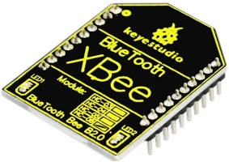
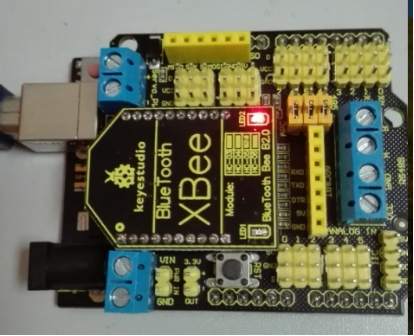
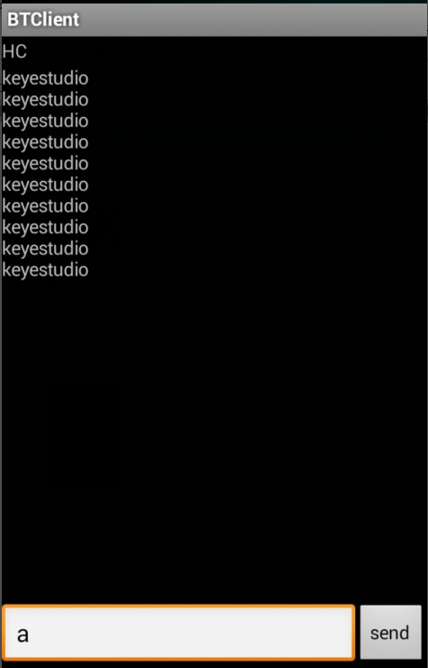

# KS0143 keyestudio XBee Bluetooth Wireless Module HC-05



## 1. Introduction

Keyestudio Bluetooth XBee Bluetooth wireless module HC-05 adopts XBEE design.

It has features of compact size, compatible with XBEE shield, and suitable for various 3.3V MCU systems.

The module can use AT command to set baud rate and master/slave mode, user info etc. The default settings are baud rate 38400, paring password 1234.

It comes with efficient on-board antenna. The exposed antenna ensures better signal quality and longer transmitting distance. Transparent serial port can be used to pair up with various Bluetooth adapters, Bluetooth phones.

The humanized design offers convenience for secondary development. After testing, the module is known to be suitable in using with all Bluetooth adapters on the market (PC and phones with Bluetooth).

## 2. Specification

- Supply voltage: 3.3V (voltage above 3.3V is forbidden. It will damage the module)
- Bluetooth paring user name: HC-05
- Bluetooth paring password: 1234
- Default baud rate: 38400
- Modified baud rate takes effect after module reboot

## 3. Connection

Stack it onto the board



## 4. Sample Code

Download code : [Code](./Code.7z)

```c
int val; 
int ledpin=13; 

void setup() 
{ 
   Serial.begin(9600);
   pinMode(ledpin,OUTPUT); 
} 

void loop()
{ 
    val=Serial.read(); 
    if(val=='a')
    { 
        digitalWrite(ledpin,HIGH); 
        delay(250); 
        digitalWrite(ledpin,LOW); 
        delay(250);
        Serial.println("keyestudio");
    }
}
```

## 5. Test Result

Connect the shield to APC ports; enter cell phone “settings”; pair up the Bluetooth; device name is HC-05; pairing PIN No. is 1234. After device is paired, open APP “BTClient”; click search for device, pair up the Bluetooth.

After successful connection, enter “a” in BTClient and click send, the BTClient APP page will display keyestudio. And Pin13 LED will blink once.

